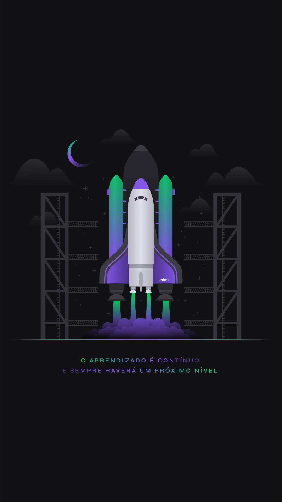
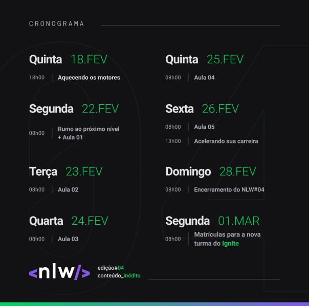

<h3>#rumoaoproximonivel</h3>

   

<!-- ******************************* Título do Projeto ****************************************  -->
<h1 align="center" > Next Level Week 04 - Projeto Moveit</h1>

<!-- *******************************  Status do Projeto  **************************************  -->

   Status do Projeto :  🚧 Projeto em Construção  🚧

 
<!-- ************************************  Badges  ********************************************  -->

  

  

  

<!-- ******************************* Ancoras **************************************************  -->

  <a href="#sobre">Sobre o Projeto</a>&nbsp;&nbsp;&nbsp;|&nbsp;&nbsp;&nbsp;
  <a href="#cronograma">Cronograma do Projeto</a>&nbsp;&nbsp;&nbsp;|&nbsp;&nbsp;&nbsp;
  <a href="#tecnologias">Tecnologias e Bibliotecas</a>&nbsp;&nbsp;&nbsp;|&nbsp;&nbsp;&nbsp;
  &nbsp;&nbsp;&nbsp;|&nbsp;&nbsp;&nbsp;
  &nbsp;&nbsp;&nbsp;|&nbsp;&nbsp;&nbsp;

<!-- ******************************* Sobre ***************************************************  -->

<h2 id="sobre"> 🚀 Sobre o Projeto </h2>
Em breve o resultado final do projeto.

<h2 id="cronograma"> 📆 Cronograma do Projeto</h2>

   

<h2 id="tecnologias"> 🧰 Tecnologias e Bibliotecas</h2>

* [HTML](https://www.w3schools.com/html/) 
* [CSS](https://www.w3schools.com/css/) 
* [JavaScript](https://www.w3schools.com/js/DEFAULT.asp)
* [TypeScript](https://www.typescriptlang.org/) - Linguagem baseada em JavaScript que adicionar definições de tipo estático.
* [ReactJS](https://pt-br.reactjs.org/) - Biblioteca JavaScript para criação de Interfaces.   